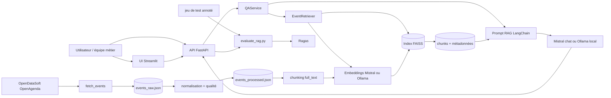

# Projet 7 - POC RAG culturel

POC de chatbot de recommandation culturelle basé sur le dataset public
`evenements-publics-openagenda` exposé par OpenDataSoft.

```text
OpenDataSoft -> ingestion -> dataset -> chunks -> embeddings -> vector store -> API
                            \_______________________________________________/
                                         évaluation + tests
```

## Source de données

Source unique du projet :

```text
https://public.opendatasoft.com/api/explore/v2.1/catalog/datasets/evenements-publics-openagenda/records
```

Le projet n'utilise pas l'API OpenAgenda directe et ne nécessite pas de clé
OpenAgenda. Les filtres principaux sont appliqués via les paramètres
OpenDataSoft : ville, période, recherche texte et mots-clés.

## Arborescence

```text
app/
|-- clients/          # client OpenDataSoft
|-- ingestion/        # collecte, normalisation, dataset
|-- rag/              # chunking, embeddings, vector store, retrieval
|-- services/         # orchestration métier
|-- api/              # routes et schémas FastAPI
`-- config.py         # variables d'environnement
scripts/              # commandes locales
tests/                # unitaires, intégration, fixtures
data/                 # données et artefacts locaux ignorés par Git
docs/                 # rapport technique
```

## Rapport technique synthétique

### Architecture UML



### Composants

- `OpenDataSoftEventsClient` récupère les événements publics avec pagination,
  filtres de ville, période, recherche texte et mots-clés.
- `normalize_events` nettoie les champs utiles, enlève le HTML et construit
  `full_text`, le texte documentaire indexé ensuite.
- `assess_events_quality` produit un rapport qualité : complétude des champs,
  longueur de `full_text`, doublons et événements indexables.
- `chunk_events` découpe `full_text` en morceaux avec chevauchement pour limiter
  la perte d'information au moment de l'indexation.
- `OllamaEmbeddingModel` transforme les chunks et les questions en vecteurs
  sémantiques avec `nomic-embed-text`. `MistralEmbeddingModel` reste disponible
  si l'on veut reconstruire l'index avec `mistral-embed`.
- `FaissVectorStore` stocke les vecteurs dans FAISS via LangChain. Le projet
  construit deux index simples : `future` pour les événements à venir et `past`
  pour les événements terminés.
- `OllamaAnswerGenerator` construit le prompt RAG et génère localement avec
  `qwen2.5:7b`. En mode `auto`, Mistral sert seulement de secours si Ollama
  échoue et si `MISTRAL_API_KEY` est renseignée.
- `QAService` orchestre explicitement la chaîne : question, retrieval, contexte,
  génération, réponse JSON avec sources.
- `FastAPI` expose `/health`, `/metadata`, `/ask` et `/rebuild`.
- `evaluate_rag.py` compare les réponses générées au jeu annoté avec Ragas.
- `Dockerfile` et `docker-compose.yml` rendent la démonstration locale
  reproductible avec l'API et l'interface Streamlit.

### Choix technologiques et modèles

- `FastAPI` est utilisé pour obtenir une API REST simple, typée et documentée
  automatiquement avec Swagger.
- `LangChain` fournit l'intégration FAISS et la structuration du prompt RAG.
- `FAISS` permet une recherche vectorielle locale rapide et portable avec
  `faiss-cpu`.
- `Ollama` est utilisé par défaut pour les embeddings (`nomic-embed-text`) et
  la génération locale (`qwen2.5:7b`).
- `Mistral` reste disponible comme fournisseur de secours pour la génération et
  comme option alternative d'embeddings si l'index est reconstruit avec Mistral.
- `Ragas` automatise les métriques d'évaluation attendues par la grille.

### Paramétrage métier

Le POC cible par défaut Paris, avec un historique de 365 jours et une fenêtre
future de 90 jours. Ces valeurs par défaut sont définies dans `app/config.py`.
Le fichier `.env` sert surtout à renseigner les secrets, par exemple
`MISTRAL_API_KEY`, ou à surcharger ponctuellement une valeur sans modifier le
code.

Les paramètres modifiables à l'exécution dans `/ask` et dans l'interface
Streamlit sont `top_k`, `retrieval_max_score`, `temperature`, `max_tokens`,
`llm_provider` et `llm_model`. Ils ne modifient pas le `.env` : ils
s'appliquent seulement à la requête envoyée.

Les paramètres qui changent la construction de l'index, comme `CHUNK_SIZE`,
`CHUNK_OVERLAP`, `MISTRAL_EMBEDDING_MODEL`, `EMBEDDING_PROVIDER`,
`OLLAMA_EMBEDDING_MODEL` ou la source de données, nécessitent de reconstruire
l'index.

### Mode local Ollama

Le projet est configuré pour tourner localement avec Ollama :

```bash
ollama serve
ollama pull qwen2.5:7b
ollama pull nomic-embed-text
```

Configuration par défaut :

```bash
LLM_PROVIDER=auto
EMBEDDING_PROVIDER=ollama
OLLAMA_CHAT_MODEL=qwen2.5:7b
OLLAMA_EMBEDDING_MODEL=nomic-embed-text
```

En mode `auto`, Ollama est tenté en premier. Mistral n'est utilisé qu'en secours
si la génération locale échoue et si `MISTRAL_API_KEY` est renseignée.

Vérifier que les modèles tournent sur GPU :

```bash
ollama ps
nvidia-smi
```

Sur la machine de développement utilisée, `qwen2.5:7b` et `nomic-embed-text`
sont bien chargés par Ollama avec `PROCESSOR = 100% GPU` sur la RTX PRO 5000
Blackwell 24 Go.

Puis ajouter dans `.env` :

```text
EMBEDDING_PROVIDER=ollama
OLLAMA_EMBEDDING_MODEL=nomic-embed-text
```

Et reconstruire l'index :

```bash
uv run python scripts/rebuild_index.py --index
```

Le fournisseur d'embeddings utilisé à la requête doit rester cohérent avec le
fournisseur utilisé lors de la construction de l'index, sinon les dimensions et
la géométrie des vecteurs ne correspondent plus.

Le prompt système injecte la date du jour, impose de répondre uniquement à
partir du contexte fourni, de signaler les limites du contexte, et de citer des
événements concrets avec titre, lieu et date lorsque ces informations sont
disponibles. Il précise aussi qu'une question visant un événement futur ne doit
pas recommander de source dont la date de fin est antérieure à la date du jour.

### Résultats observés

Dernière évaluation Ragas observée sur 8 questions annotées, avec Mistral comme
juge d'évaluation :

- `faithfulness` : 0.9006, les réponses restent majoritairement fidèles aux
  sources récupérées, avec quelques formulations à surveiller.
- `answer_relevance` : 0.6224, les réponses restent utiles par rapport aux
  questions, avec une marge de progression sur la formulation et la concision.
- `context_precision` : 0.8750, les contextes utiles sont généralement bien
  classés, mais pas toujours en première position.
- `context_recall` : 0.7917, les contextes récupérés couvrent une partie
  importante des informations attendues, sans couvrir tous les cas.

### Limites et pistes d'amélioration

- Améliorer la classification simple `future` / `past` pour couvrir davantage
  de formulations calendaires, par exemple "le premier week-end de juin".
- Étendre le jeu de test annoté à davantage de catégories culturelles et de
  villes.
- Ajouter une évaluation régulière dans une CI complète avec seuils minimums.
- Tester plusieurs stratégies de reranking ou un reranker dédié si le volume de
  données augmente.
- Prévoir une authentification plus complète si `/rebuild` était exposé hors
  environnement local.

## Démarrer le projet depuis un clone

Cette section décrit le chemin le plus simple pour lancer le projet sur une
nouvelle machine après duplication du dépôt.

### 1. Récupérer le dépôt

```bash
git clone https://github.com/rayakevin/PROJET_7.git
cd PROJET_7
```

### 2. Installer l'environnement Python

Le projet cible Python 3.11. La méthode recommandée utilise `uv`, car le dépôt
contient un `pyproject.toml` et un `uv.lock`.

```bash
uv sync --group dev
```

Cette commande crée ou met à jour l'environnement local `.venv` avec les
dépendances de production et de test.

Si `uv` n'est pas disponible, une installation classique reste possible :

```powershell
python -m venv .venv
.\.venv\Scripts\python.exe -m pip install --upgrade pip
.\.venv\Scripts\python.exe -m pip install -r requirements.txt
```

### 3. Créer le fichier `.env`

Copier le modèle :

```powershell
copy .env.example .env
```

Sous macOS/Linux, utiliser plutôt :

```bash
cp .env.example .env
```

Pour utiliser Mistral, la seule valeur obligatoire à renseigner est :

```text
MISTRAL_API_KEY=...
```

Aucune clé OpenAgenda/OpenDataSoft n'est nécessaire : la source utilisée est un
endpoint public. Les autres paramètres ont des valeurs par défaut dans
`app/config.py` et ne doivent être ajoutés au `.env` que pour les surcharger.

### 4. Vérifier l'installation

```powershell
uv run python scripts/check_environment.py
uv run pytest
uv run python scripts/run_pytest.py
```

Avec l'installation classique sans `uv`, utiliser plutôt
`.\.venv\Scripts\python.exe -m pytest`.

Pour conserver une trace des tests unitaires et d'intégration dans des fichiers :

```powershell
uv run python scripts/run_pytest.py
```

Sorties par défaut :

- `data/evaluation/results/pytest_report_<timestamp>.txt`
- `data/evaluation/results/pytest_report_<timestamp>.json`
- `data/evaluation/results/pytest_report_latest.txt`
- `data/evaluation/results/pytest_report_latest.json`

### 5. Préparer les données et l'index FAISS

Si `data/vector_store/future` et `data/vector_store/past` contiennent chacun
`index.faiss`, `index.pkl` et `chunks.json`, l'API peut démarrer directement.

Sinon, reconstruire l'index :

```powershell
uv run python scripts/rebuild_index.py --fetch --index --city Paris
```

Pour un test rapide sans vectoriser tout le dataset :

```powershell
uv run python scripts/rebuild_index.py --index --max-events 20
```

### 6. Lancer l'API en local

```powershell
uv run python scripts/run_api.py
```

L'API est ensuite disponible ici :

```text
http://127.0.0.1:8000/docs
```

La page racine `http://127.0.0.1:8000/` peut retourner `404`, ce n'est pas une
erreur : les endpoints utiles sont `/docs`, `/health`, `/metadata`, `/ask` et
`/rebuild`.

Si le port 8000 est déjà utilisé :

```powershell
$env:APP_PORT="8010"
uv run python scripts/run_api.py
```

### 7. Lancer l'interface Streamlit

Dans un deuxième terminal, après avoir lancé l'API :

```powershell
uv run streamlit run ui/streamlit_app.py
```

Interface disponible :

```text
http://127.0.0.1:8501
```

Streamlit appelle l'API FastAPI et permet de régler les principaux paramètres
de génération et de retrieval : fournisseur LLM, modèle, température, nombre de
sources, seuil de distance FAISS et longueur de réponse.

### 8. Choisir le modèle de génération

Par défaut, le projet utilise Ollama en local :

```text
LLM_PROVIDER=auto
OLLAMA_CHAT_MODEL=qwen2.5:7b
```

Préparer les modèles locaux :

```powershell
ollama serve
ollama pull qwen2.5:7b
ollama pull nomic-embed-text
```

Pour forcer Mistral :

```text
LLM_PROVIDER=mistral
MISTRAL_CHAT_MODEL=mistral-small-latest
```

En mode automatique, Ollama est tenté en premier puis Mistral prend le relais
si Ollama échoue :

```text
LLM_PROVIDER=auto
OLLAMA_CHAT_MODEL=qwen2.5:7b
```

Important : le choix du modèle de génération peut se faire à la requête. En
revanche, le fournisseur d'embeddings doit rester cohérent avec l'index FAISS.
L'index actuel est construit avec `nomic-embed-text`, donc les questions doivent
être vectorisées avec Ollama sauf reconstruction complète avec Mistral.

## Ingestion

Construire le dataset brut puis normalisé :

```bash
uv run python scripts/rebuild_index.py --fetch
```

Exemple avec une ville explicite :

```bash
uv run python scripts/rebuild_index.py --fetch --city Paris
```

Sorties par défaut :

- `data/raw/events_raw.json`
- `data/processed/events_processed.json`
- `data/processed/events_quality_report.json`

## Indexation RAG

Le dataset normalisé est découpé en chunks à partir du champ `full_text`, puis
les chunks sont vectorisés avec le fournisseur d'embeddings configuré
(`mistral` par défaut) et sauvegardés dans un index FAISS.

Construire uniquement l'index à partir du dataset déjà présent :

```bash
uv run python scripts/rebuild_index.py --index
```

Faire un test limité pour éviter de vectoriser tout le dataset :

```bash
uv run python scripts/rebuild_index.py --index --max-events 20
```

Reconstruire toute la chaîne ingestion + dataset + index :

```bash
uv run python scripts/rebuild_index.py --fetch --index --city Paris
```

Sorties FAISS par défaut :

- `data/vector_store/future/index.faiss`
- `data/vector_store/future/index.pkl`
- `data/vector_store/future/chunks.json`
- `data/vector_store/past/index.faiss`
- `data/vector_store/past/index.pkl`
- `data/vector_store/past/chunks.json`
- `data/prompt_logs/prompt_<timestamp>_<id>.json` pour chaque prompt complet
  envoyé au modèle lors d'une question.

## Chatbot RAG

Le service de question-réponse classe d'abord la question en intention
`future` ou `past`, charge l'index FAISS correspondant, récupère les chunks les
plus proches avec LangChain, construit un prompt contextualisé, puis génère une
réponse naturelle avec Ollama ou Mistral selon `LLM_PROVIDER`.

Exemple Python local :

```bash
uv run python -c "from app.services.qa_service import QAService; r=QAService().ask('Quels concerts de jazz sont disponibles à Paris ?'); print(r.to_dict())"
```

La réponse contient :

- `question` : question utilisateur ;
- `answer` : réponse générée par le fournisseur LLM configuré ;
- `sources` : chunks/événements utilisés avec titre, lieu, dates et distance
  FAISS (`score`, plus bas = plus proche).

À chaque appel au modèle, le prompt complet est sauvegardé localement dans
`data/prompt_logs`. Le fichier contient les messages envoyés au fournisseur LLM,
le contexte RAG, les sources utilisées, le modèle, la température et le nombre
maximum de tokens. Ces fichiers sont ignorés par Git.

## API REST

Lancer l'API localement :

```bash
uv run python scripts/run_api.py
```

Swagger est disponible à l'adresse :

```text
http://127.0.0.1:8000/docs
```

Endpoints principaux :

- `GET /health` : état de l'API et présence de l'index local ;
- `GET /metadata` : configuration publique du POC, sans secret ;
- `POST /ask` : question utilisateur vers le chatbot RAG ;
- `POST /feedback` : retour utilisateur sur une interaction déjà enregistrée ;
- `POST /rebuild` : reconstruction du dataset et de l'index FAISS.

### Gestion des codes HTTP

| Code | Cas couvert | Exemple |
|---|---|---|
| `200` | Requête valide | `/health`, `/metadata`, `/ask`, `/rebuild` |
| `404` | Ressource absente | Feedback envoyé sur un `interaction_id` inconnu |
| `403` | Accès refusé à une route sensible | Token `X-Rebuild-Token` absent ou invalide sur `/rebuild` |
| `422` | Corps de requête invalide | Question vide, `top_k=0`, `temperature` hors plage, fournisseur LLM inconnu |
| `503` | Service temporairement indisponible | Index FAISS absent, erreur Mistral/Ollama, erreur de rebuild |

FastAPI et Pydantic valident automatiquement les types et les bornes des
paramètres. Les erreurs métier sont converties en réponses JSON explicites pour
éviter une erreur serveur générique pendant la démonstration.

Exemple `/ask` :

```bash
curl -X POST http://127.0.0.1:8000/ask \
  -H "Content-Type: application/json" \
  -d "{\"question\":\"Quels concerts de jazz sont disponibles à Paris ?\"}"
```

Exemple `/metadata` :

```bash
curl http://127.0.0.1:8000/metadata
```

Exemple `/feedback` inspiré du cours RAG :

```bash
curl -X POST http://127.0.0.1:8000/feedback \
  -H "Content-Type: application/json" \
  -d "{\"interaction_id\":1,\"score\":\"positive\",\"comment\":\"Réponse utile\"}"
```

Exemple `/rebuild` limité à 20 événements pour un test rapide :

```bash
curl -X POST http://127.0.0.1:8000/rebuild \
  -H "Content-Type: application/json" \
  -d "{\"fetch\":false,\"max_events\":20}"
```

Si `API_REBUILD_TOKEN` est renseigné, `/rebuild` exige l'en-tête
`X-Rebuild-Token`.

Test fonctionnel manuel :

```bash
uv run python scripts/api_test.py
```

## Docker

L'image Docker embarque le code de l'API et l'index FAISS présent dans
`data/vector_store`. Les données brutes et intermédiaires ne sont pas copiées,
ce qui garde l'image raisonnable tout en permettant une démo autonome.
Le dossier `data/prompt_logs` reste monté en volume ciblé avec Docker Compose
pour récupérer localement les prompts complets générés par l'API.
Les feedbacks utilisateur sont stockés dans `data/interactions/interactions.db`, une base
SQLite locale ignorée par Git.
Docker Desktop doit être lancé avant le build.
Pour une démo fluide, construire ou vérifier l'index avant le build :

```bash
uv run python scripts/rebuild_index.py --index
```

Construire puis lancer l'API :

```bash
docker build -t projet7-rag-api .
docker run --rm --env-file .env -p 8000:8000 projet7-rag-api
```

Avec Docker Compose :

```bash
docker compose up --build
```

Interfaces disponibles :

- API Swagger : `http://127.0.0.1:8000/docs`
- UI Streamlit : `http://127.0.0.1:8501`

Vérification :

```bash
curl http://127.0.0.1:8000/health
uv run python scripts/api_test.py
```

## Interface Streamlit

Une interface locale permet d'interroger l'API avec des contrôles sur les
principaux hyperparamètres :

- température du LLM ;
- nombre de sources `top_k` ;
- distance FAISS maximale, plus basse signifie plus proche de la question ;
- longueur maximale de réponse ;
- feedback positif/négatif sur la dernière réponse, enregistré localement dans
  SQLite.

Lancer d'abord l'API dans un premier terminal :

```powershell
uv run python scripts/run_api.py
```

Puis lancer Streamlit dans un deuxième terminal :

```powershell
uv run streamlit run ui/streamlit_app.py
```

Ou lancer les deux via Docker Compose :

```bash
docker compose up --build
```

## Éléments repris du cours RAG

Le dossier de cours `8532116-mettez-en-place-un-rag-pour-un-llm-main` a servi
de référence pour trois éléments du POC :

- journaliser les questions, réponses, sources et paramètres dans SQLite ;
- associer un feedback utilisateur simple à une interaction ;
- afficher clairement les sources et le score retourné par la recherche
  vectorielle.

La classification `RAG` / `DIRECT` du cours n'a pas été reprise telle quelle :
dans cette mission, le comportement attendu est de démontrer un assistant
événementiel qui interroge systématiquement la base OpenAgenda vectorisée.

## Évaluation

Le jeu de test annoté se trouve dans `tests/fixtures/qa_dataset.json`.
Le script d'évaluation interroge le chatbot, stocke les réponses et calcule :

- métriques locales : nombre de sources et distance FAISS moyenne ;
- métriques Ragas attendues par la grille : `faithfulness`, `answer_relevance`,
  `context_precision` et `context_recall`.

Lancer l'évaluation complète :

```bash
uv run python scripts/evaluate_rag.py
```

Lancer uniquement les métriques locales :

```bash
uv run python scripts/evaluate_rag.py --skip-ragas
```

Sorties par défaut :

- `data/evaluation/results/rag_evaluation_<timestamp>.json`
- `data/evaluation/results/rag_evaluation_latest.json`
- `data/evaluation/results/pytest_report_<timestamp>.txt`
- `data/evaluation/results/pytest_report_<timestamp>.json`
- `data/evaluation/results/pytest_report_latest.txt`
- `data/evaluation/results/pytest_report_latest.json`

Le rapport expose les noms internes Ragas et un résumé lisible dans
`summary.required_ragas_metrics` :

```json
{
  "faithfulness": 0.9006,
  "answer_relevance": 0.6224,
  "context_precision": 0.875,
  "context_recall": 0.7917
}
```

Dernier résultat observé sur 8 questions annotées :

```text
Faithfulness: 0.9006
Answer relevance: 0.6224
Context precision: 0.8750
Context recall: 0.7917
Sources moyennes: 2.6250
Distance FAISS moyenne: 0.3741
```

## Configuration

Les valeurs ci-dessous sont définies par défaut dans `app/config.py`. Elles ne
doivent être ajoutées au `.env` que si l'on veut les surcharger localement.

| Variable | Défaut | Usage |
|---|---|---|
| `MISTRAL_API_KEY` | vide | Secret utilisé seulement si l'on force Mistral ou si le fallback Mistral est nécessaire |
| `API_REBUILD_TOKEN` | vide | Token optionnel pour protéger `/rebuild` |
| `MISTRAL_EMBEDDING_MODEL` | `mistral-embed` | Modèle d'embeddings |
| `MISTRAL_CHAT_MODEL` | `mistral-small-latest` | Modèle de génération |
| `LLM_PROVIDER` | `auto` | Génération : `ollama` d'abord, puis Mistral en secours si disponible |
| `EMBEDDING_PROVIDER` | `ollama` | Embeddings : `ollama` par défaut ou `mistral` après reconstruction |
| `OLLAMA_BASE_URL` | `http://127.0.0.1:11434` | Serveur Ollama local |
| `OLLAMA_CHAT_MODEL` | `qwen2.5:7b` | Modèle local de génération |
| `OLLAMA_EMBEDDING_MODEL` | `nomic-embed-text` | Modèle local d'embeddings |
| `OLLAMA_MIN_TOKENS` | `600` | Minimum de génération Ollama |
| `OLLAMA_NUM_CTX` | `8192` | Taille de contexte Ollama pour limiter la pression VRAM/RAM |
| `LLM_TEMPERATURE` / `LLM_MAX_TOKENS` | `0.2` / `600` | Paramètres de génération par défaut |
| `EMBEDDING_BATCH_SIZE` | `64` | Taille des lots envoyés au fournisseur d'embeddings |
| `OPENDATASOFT_RECORDS_URL` | endpoint public OpenDataSoft | Source de données |
| `EVENTS_LOCATION` | `Paris` | Ville cible par défaut |
| `EVENTS_LOOKBACK_DAYS` | `365` | Historique récupéré, en jours |
| `EVENTS_LOOKAHEAD_DAYS` | `90` | Événements futurs récupérés, en jours |
| `EVENTS_PAGE_SIZE` | `100` | Taille de page OpenDataSoft |
| `DATA_DIR` | `data/` | Racine des données locales |
| `VECTOR_STORE_DIR` | `data/vector_store` | Racine des deux index `future/` et `past/` |
| `PROMPT_LOGS_DIR` | `data/prompt_logs` | Prompts complets sauvegardés à chaque appel LLM |
| `INTERACTION_DB_PATH` | `data/interactions/interactions.db` | Journal SQLite local des questions, réponses, sources et feedbacks |
| `TOP_K` | `3` | Nombre maximum de chunks retournés par défaut |
| `RETRIEVAL_MAX_SCORE` | `0.45` | Distance FAISS maximale conservée par défaut |
| `CHUNK_SIZE` / `CHUNK_OVERLAP` | `800` / `100` | Découpage documentaire |

## Stack prévue

`Python 3.11` | `uv` | `FastAPI` | `OpenDataSoft` | `LangChain` |
`FAISS` | `Mistral` | `Ollama` | `Ragas` | `pytest`

## Livrables

- Rapport technique : `docs/rapport_technique.md`.
- README utilisé comme guide de lancement et documentation synthétique.
- Jeu de test annoté : `tests/fixtures/qa_dataset.json`.
- Évaluation automatisée : `scripts/evaluate_rag.py`.
- API REST : `app/api/routes.py`.
- Démonstration Docker : `Dockerfile` et `docker-compose.yml`.
- Interface locale : `ui/streamlit_app.py`.
