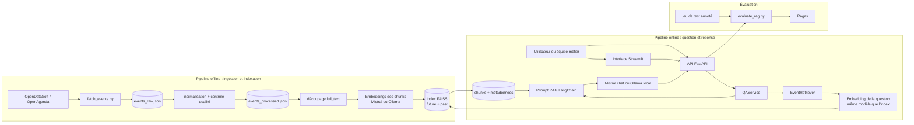
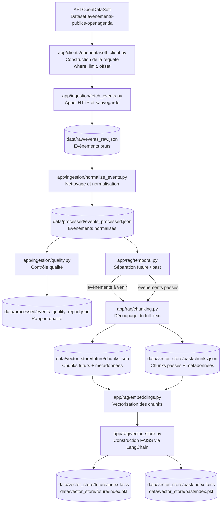

# Rapport technique - Assistant intelligent de recommandation d'événements culturels

## 1. Objectifs du projet

### Contexte

Puls-Events souhaite tester un assistant intelligent capable de répondre à des
questions utilisateurs sur des événements culturels. La mission consiste à
livrer un POC complet combinant récupération de données, indexation vectorielle,
génération de réponse et exposition via API REST.

Le système s'appuie sur le dataset public OpenDataSoft
`evenements-publics-openagenda`, qui expose des événements issus d'OpenAgenda.
Ce choix permet d'utiliser une source ouverte, requêtable sans clé API
OpenAgenda, tout en respectant la contrainte métier : fournir des
recommandations culturelles à partir de données récentes ou à venir.

### Problématique

Une recherche classique par mots-clés ne suffit pas toujours pour répondre à des
questions naturelles comme :

- "Je cherche un concert de Gospel Jazz pour la Fête de la musique à Paris."
- "Je veux faire une activité cosplay à la Cité des sciences."
- "Y a-t-il une avant-première du film RED BIRD à Paris ?"

Un système RAG répond à ce besoin en combinant :

- une recherche documentaire dans une base vectorielle ;
- la récupération de sources pertinentes ;
- une réponse naturelle générée par un LLM ;
- une réponse sourcée et exploitable par une API.

### Objectif du POC

Le POC cherche à démontrer trois points :

- Faisabilité technique : ingestion OpenDataSoft, embeddings Mistral, index
  FAISS, orchestration LangChain et API FastAPI.
- Valeur métier : réponse claire à des questions réalistes sur des événements
  culturels.
- Performance initiale : récupération de sources cohérentes et métriques
  d'évaluation automatisées avec Ragas.

### Périmètre

- Zone géographique : Paris par défaut.
- Période : 365 jours d'historique et 90 jours d'événements futurs.
- Source : endpoint public OpenDataSoft
  `evenements-publics-openagenda/records`.
- Données utilisées : titre, description, lieu, ville, dates, mots-clés et texte
  documentaire consolidé `full_text`.
- Historique conversationnel : hors périmètre du POC.

## 2. Architecture du système

### Schéma global d'architecture UML simplifié



### Technologies utilisées

| Brique | Technologie | Rôle |
|---|---|---|
| Langage | Python 3.11 | Développement du pipeline et de l'API |
| Gestion projet | uv, requirements.txt | Reproductibilité de l'environnement |
| API | FastAPI, Uvicorn | Endpoints REST et Swagger |
| Données | OpenDataSoft / OpenAgenda | Source d'événements culturels |
| Vectorisation | Ollama `nomic-embed-text`, Mistral optionnel | Embeddings des chunks et questions |
| Base vectorielle | FAISS via LangChain | Deux index locaux : futur et passé |
| Génération | Ollama `qwen2.5:7b`, Mistral en secours | Réponse naturelle |
| Orchestration | LangChain | Prompt RAG, intégration FAISS et LLM |
| Évaluation | Ragas, pytest | Métriques RAG et tests automatisés |
| Démo | Docker, Docker Compose, Streamlit | Exécution locale et interface de test |

## 3. Préparation et vectorisation des données

### Source de données

Le projet utilise l'endpoint :

```text
https://public.opendatasoft.com/api/explore/v2.1/catalog/datasets/evenements-publics-openagenda/records
```

Les filtres appliqués sont :

- ville : Paris par défaut ;
- date de début non nulle ;
- ville non nulle ;
- fenêtre temporelle : J-365 à J+90 ;
- recherche texte optionnelle ;
- mots-clés optionnels.

La récupération gère la pagination OpenDataSoft avec `limit` et `offset`.

### Schéma de données : de l'ingestion au stockage

Le schéma ci-dessous montre ce que deviennent les données depuis l'appel
OpenDataSoft jusqu'au stockage local utilisé par le RAG.



Lecture du schéma :

| Étape | Fichier ou objet produit | Contenu principal | Utilisation ensuite |
|---|---|---|---|
| Ingestion brute | `data/raw/events_raw.json` | Liste d'événements tels que retournés par OpenDataSoft, avec la structure source | Sert d'entrée reproductible au nettoyage |
| Normalisation | `data/processed/events_processed.json` | Événements simplifiés avec `uid`, `title`, `description`, `location_name`, `city`, `start`, `end`, `keywords`, `full_text` | Sert d'entrée au chunking et à l'indexation |
| Contrôle qualité | `data/processed/events_quality_report.json` | Complétude des champs, longueurs de `full_text`, doublons d'UID, événements indexables | Permet de vérifier que le dataset est exploitable |
| Chunking futur | `data/vector_store/future/chunks.json` | Chunks textuels des événements à venir avec métadonnées métier | Permet de relire les textes associés à l'index futur |
| Chunking passé | `data/vector_store/past/chunks.json` | Chunks textuels des événements passés avec métadonnées métier | Permet de relire les textes associés à l'index passé |
| Index vectoriel futur | `data/vector_store/future/index.faiss` et `index.pkl` | Vecteurs FAISS et structure LangChain des événements futurs | Interrogé par défaut pour les questions de recommandation |
| Index vectoriel passé | `data/vector_store/past/index.faiss` et `index.pkl` | Vecteurs FAISS et structure LangChain des événements passés | Interrogé si la question vise explicitement le passé |

Structure simplifiée d'un événement normalisé :

```json
{
  "uid": "39389254",
  "title": "Concert de Gospel Jazz",
  "description": "Fête de la musique 2025...",
  "location_name": "132 avenue de Versailles",
  "city": "Paris",
  "start": "2025-06-21T16:30:00+00:00",
  "end": "2025-06-21T18:30:00+00:00",
  "keywords": ["jazz", "gospel", "concert"],
  "full_text": "Titre : Concert de Gospel Jazz\nMots-clés : jazz, gospel, concert\n..."
}
```

Structure simplifiée d'un chunk indexé :

```json
{
  "id": "39389254::chunk-0",
  "text": "Titre : Concert de Gospel Jazz Mots-clés : jazz, gospel...",
  "metadata": {
    "event_uid": "39389254",
    "chunk_index": 0,
    "title": "Concert de Gospel Jazz",
    "city": "Paris",
    "location_name": "132 avenue de Versailles",
    "start": "2025-06-21T16:30:00+00:00",
    "end": "2025-06-21T18:30:00+00:00",
    "keywords": ["jazz", "gospel", "concert"]
  }
}
```

### Nettoyage

Les événements bruts sont normalisés dans `app/ingestion/normalize_events.py`.
Les traitements principaux sont :

- nettoyage des espaces, tabulations et retours ligne ;
- suppression du HTML dans les descriptions longues ;
- gestion des champs multilingues OpenAgenda ;
- harmonisation des champs `title`, `description`, `location_name`, `city`,
  `start`, `end`, `keywords` ;
- déduplication des mots-clés ;
- construction du champ `full_text`.

Exemple de structure `full_text` :

```text
Titre : Concert de Gospel Jazz
Mots-clés : jazz, gospel, concert
Ville : Paris
Lieu : 132 avenue de Versailles
Début : 2025-06-21T16:30:00+00:00
Fin : 2025-06-21T18:30:00+00:00
Description : ...
```

Un rapport qualité est généré pour suivre :

- la complétude des champs obligatoires ;
- la longueur du champ `full_text` ;
- les doublons d'UID ;
- le nombre d'événements indexables.

### Chunking

Le chunking est réalisé à partir de `full_text`.

Paramètres par défaut :

- taille de chunk : 800 caractères ;
- chevauchement : 100 caractères.

Le découpage limite la perte d'information quand les descriptions sont longues.
Les métadonnées métier restent attachées à chaque chunk pour pouvoir sourcer les
réponses.

### Embedding

Le modèle utilisé par défaut est `nomic-embed-text` via Ollama.

Caractéristiques du POC :

- dimension de l'index dépendante du modèle d'embeddings local utilisé ;
- vectorisation par lots de 64 textes par défaut ;
- délai configurable entre les lots ;
- exécution locale possible sans appel API externe ;
- format final : listes de nombres flottants stockées dans FAISS via LangChain.

Mistral reste disponible avec `EMBEDDING_PROVIDER=mistral`, mais l'index doit
alors être reconstruit. Le modèle utilisé pour vectoriser la question doit
toujours être le même que celui utilisé pour construire les vecteurs FAISS.

## 4. Choix du modèle NLP

### Modèles sélectionnés

- Embeddings par défaut : Ollama `nomic-embed-text`.
- Génération par défaut : Ollama `qwen2.5:7b`.
- Secours optionnel : Mistral `mistral-small-latest`.

### Pourquoi ces modèles ?

Ces modèles répondent bien au cadre du POC :

- compatibilité avec l'écosystème Python et LangChain ;
- qualité suffisante pour des réponses courtes et sourcées ;
- coût plus raisonnable qu'un modèle de génération plus lourd ;
- API simple à intégrer dans des scripts, tests et endpoints.

Ollama est utilisé en priorité pour limiter la dépendance à une API externe
pendant la démonstration. Le mode `LLM_PROVIDER=auto` tente Ollama en premier,
puis bascule vers Mistral si la génération locale échoue et si la clé API est
renseignée. Le modèle local par défaut est `qwen2.5:7b` car il est plus léger
que `qwen3:30b`, tient mieux en VRAM et répond directement pour une démo RAG.

### Prompting

Le prompt système utilisé se trouve dans `app/rag/answer.py`.

Il impose au modèle de :

- répondre comme assistant culturel Puls-Events ;
- tenir compte de la date du jour injectée dans le prompt ;
- utiliser uniquement le contexte fourni ;
- signaler clairement si le contexte ne suffit pas ;
- ne pas recommander une source passée lorsque la question vise un événement
  futur ou une prochaine édition ;
- proposer des événements concrets avec titre, lieu et date ;
- rester concis, utile et naturel.

### Limites du modèle

- Le modèle peut reformuler ou simplifier des horaires.
- Le mode local dépend du modèle Ollama installé et des ressources matérielles
  disponibles.
- Il dépend de la qualité des sources récupérées.
- Il ne remplace pas une validation humaine pour les données sensibles ou
  contractuelles.
- Les questions temporelles sont gérées par un filtre simple sur les métadonnées
  `start` et `end` pour les expressions courantes comme "ce week-end" ou
  "prochaines semaines". La "Fête de la musique" est également reconnue et
  cible le prochain 21 juin si aucune année n'est précisée. Les formulations
  temporelles plus complexes restent une limite du POC.

## 5. Construction de la base vectorielle

### FAISS utilisé

Le projet utilise FAISS via `langchain_community.vectorstores.FAISS`.

La construction est faite dans `app/rag/vector_store.py` :

- création des embeddings ;
- association de chaque vecteur à un chunk ;
- conservation des métadonnées ;
- sauvegarde locale de l'index.

Avant la construction FAISS, les événements sont séparés en deux groupes :

- `future` : événements non terminés à la date de reconstruction ;
- `past` : événements déjà terminés.

Le retriever classe ensuite simplement la question : une formulation passée
explicite interroge l'index `past`, sinon l'index `future` est utilisé par
défaut. Cette approche est volontairement lisible pour un POC étudiant.

### Stratégie de persistance

Les fichiers générés sont :

- `data/vector_store/future/index.faiss` : index FAISS des événements futurs ;
- `data/vector_store/future/index.pkl` : structure LangChain associée ;
- `data/vector_store/future/chunks.json` : chunks futurs lisibles ;
- `data/vector_store/past/index.faiss` : index FAISS des événements passés ;
- `data/vector_store/past/index.pkl` : structure LangChain associée ;
- `data/vector_store/past/chunks.json` : chunks passés lisibles.

Le chargement de `index.pkl` utilise la désérialisation LangChain. Elle est
acceptée ici car le fichier est produit localement par les scripts du projet.

Les prompts complets envoyés au modèle sont également sauvegardés localement
dans `data/prompt_logs/prompt_<timestamp>_<id>.json` à chaque appel LLM. Ces
fichiers contiennent les messages réellement envoyés au fournisseur, le contexte
RAG, les sources, le modèle, la température et le nombre maximum de tokens. Ils
servent à l'audit et au débogage, mais ne sont pas versionnés.

### Métadonnées associées

Chaque chunk conserve :

- `event_uid` ;
- `chunk_index` ;
- titre ;
- ville ;
- nom du lieu ;
- date de début ;
- date de fin ;
- mots-clés.

Ces informations sont renvoyées dans les sources de l'API `/ask`.

## 6. API et endpoints exposés

### Framework utilisé

L'API est développée avec FastAPI.

Avantages :

- validation automatique des schémas avec Pydantic ;
- Swagger disponible sur `/docs` ;
- typage clair des requêtes et réponses ;
- intégration simple avec les tests `TestClient`.

### Endpoints clés

| Endpoint | Méthode | Rôle |
|---|---|---|
| `/health` | GET | Vérifier l'état de l'API et la présence de l'index |
| `/metadata` | GET | Exposer la configuration publique sans secret |
| `/ask` | POST | Poser une question au RAG |
| `/feedback` | POST | Enregistrer un retour utilisateur sur une réponse |
| `/rebuild` | POST | Reconstruire le dataset et l'index |

### Format `/ask`

Requête :

```json
{
  "question": "Quels concerts de jazz sont disponibles à Paris ?",
  "top_k": 3,
  "retrieval_max_score": 0.45,
  "temperature": 0.2,
  "max_tokens": 600,
  "llm_provider": "auto",
  "llm_model": "qwen2.5:7b"
}
```

Réponse :

```json
{
  "interaction_id": 1,
  "question": "Quels concerts de jazz sont disponibles à Paris ?",
  "answer": "Réponse générée par le fournisseur LLM configuré.",
  "sources": [
    {
      "chunk_id": "39389254::chunk-0",
      "event_uid": "39389254",
      "title": "Concert de Gospel Jazz",
      "city": "Paris",
      "location_name": "132 avenue de versailles",
      "start": "2025-06-21T16:30:00+00:00",
      "end": "2025-06-21T18:30:00+00:00",
      "score": 0.2087
    }
  ],
  "parameters": {
    "top_k": 3,
    "retrieval_max_score": 0.45,
    "temperature": 0.2,
    "max_tokens": 600
  }
}
```

Le champ `score` correspond à une distance FAISS : plus elle est basse, plus le
chunk est proche de la question.

Le champ `interaction_id` est enregistré dans une base SQLite locale
`data/interactions/interactions.db`. Il permet d'envoyer ensuite un feedback via
`POST /feedback`, par exemple :

```json
{
  "interaction_id": 1,
  "score": "positive",
  "comment": "Réponse utile pour la démonstration."
}
```

### Exemple d'appel API

```bash
curl -X POST http://127.0.0.1:8000/ask \
  -H "Content-Type: application/json" \
  -d "{\"question\":\"Y a-t-il une avant-première du film RED BIRD à Paris ?\"}"
```

### Tests effectués et documentés

- Tests unitaires des schémas et services.
- Tests d'intégration FastAPI.
- Script manuel `scripts/api_test.py`.
- Swagger disponible sur `http://127.0.0.1:8000/docs`.

### Gestion des erreurs et limitations

L'API gère :

- les questions vides ;
- l'absence d'index vectoriel ;
- les erreurs Mistral ou Ollama ;
- les feedbacks associés à une interaction absente ;
- la protection optionnelle de `/rebuild` par token.

Limites :

- `/rebuild` est prévu pour un usage local ou protégé ;
- la classification `future` / `past` reste volontairement simple et ne couvre
  pas toutes les formulations calendaires possibles.

### Conteneurisation Docker

Le projet fournit un `Dockerfile` et un `docker-compose.yml` pour lancer l'API et
l'interface Streamlit localement. L'image Docker embarque le code applicatif et
l'index FAISS présent dans `data/vector_store` au moment du build. Les données
brutes et intermédiaires ne sont pas copiées, ce qui garde l'image raisonnable
tout en rendant la démonstration plus autonome. Docker Compose monte seulement
`./data/prompt_logs` pour récupérer sur la machine hôte les prompts complets
générés par l'API.

La commande principale de démonstration est :

```bash
docker compose up --build
```

Pour lancer uniquement l'API :

```bash
docker build -t projet7-rag-api .
docker run --rm --env-file .env -p 8000:8000 projet7-rag-api
```

## 7. Évaluation du système

### Jeu de test annoté

Le jeu de test se trouve dans `tests/fixtures/qa_dataset.json`.

Il contient 5 exemples représentatifs :

- concert Gospel Jazz ;
- activité cosplay ;
- spectacle jeune public ;
- exposition d'art japonais ;
- avant-première du film RED BIRD.

Les réponses de référence ont été rédigées manuellement à partir des résultats
pertinents du dataset.

### Métriques d'évaluation

Le script `scripts/evaluate_rag.py` calcule :

- métriques locales :
  - nombre moyen de sources ;
  - distance FAISS moyenne ;
- métriques Ragas :
  - `faithfulness` ;
  - `answer_relevance` ;
  - `context_precision` ;
  - `context_recall`.

### Résultats obtenus

Dernière évaluation observée :

| Métrique | Score |
|---|---:|
| Faithfulness | 0.9006 |
| Answer relevance | 0.6224 |
| Context precision | 0.8750 |
| Context recall | 0.7917 |
| Sources moyennes | 2.6250 |
| Distance FAISS moyenne | 0.3741 |

### Analyse quantitative

Les scores indiquent que :

- les réponses restent majoritairement fidèles aux sources récupérées ;
- les réponses sont globalement utiles par rapport aux questions, même si la
  formulation peut encore être rendue plus directe ;
- les contextes contenant la réponse attendue sont généralement bien classés ;
- le `context_recall` montre que les contextes récupérés couvrent une partie
  importante des informations nécessaires, sans tout couvrir parfaitement.

Le `context_precision` doit être interprété avec prudence : Ragas mesure la
qualité du classement des contextes pertinents. Un score de 0.875 indique que
les sources utiles sont souvent bien placées, mais qu'il existe encore des cas
où un contexte moins central remonte avant ou avec le bon contexte. Le
`context_recall` à 0.7917 complète cette lecture : le retriever retrouve la
majorité des informations attendues, mais certaines questions ouvertes ne sont
pas couvertes entièrement.

### Analyse qualitative

Exemples de bons comportements :

- RED BIRD : le système retrouve l'avant-première exacte au Grand Rex.
- Cosplay : le système propose plusieurs événements à la Cité des sciences.
- Fête de la musique : le système retrouve l'événement musical attendu et son
  lieu.

Limites observées :

- Certaines sources secondaires sont moins pertinentes que la première.
- Les horaires peuvent être reformulés par le LLM.
- Le jeu de test reste petit : il valide un POC, pas une performance statistique
  complète.

## 8. Recommandations et perspectives

### Ce qui fonctionne bien

- Pipeline complet de bout en bout.
- API REST claire et documentée.
- Réponses JSON structurées avec sources.
- Évaluation automatisée avec Ragas.
- Démonstration locale possible avec Docker Compose et Streamlit.

### Limites du POC

- Jeu annoté limité à 8 questions.
- Périmètre géographique centré sur Paris.
- Coût et disponibilité liés aux appels Mistral si le mode par défaut est
  conservé.
- Performance variable du mode local selon le modèle Ollama choisi.
- Pas d'historique conversationnel.
- Filtre temporel limité aux expressions courantes dans `/ask`.

### Améliorations possibles

- Ajouter des paramètres temporels explicites dans `/ask`, par exemple
  `date_from` et `date_to`, en complément de la détection automatique actuelle.
- Étendre le dataset à d'autres villes.
- Augmenter le jeu de test annoté.
- Ajouter une CI lançant les tests et l'évaluation.
- Tester un reranker spécialisé si le volume de données augmente.
- Ajouter une authentification robuste pour un déploiement public.

## 9. Organisation du dépôt GitHub

```text
app/
|-- api/              # routes et schémas FastAPI
|-- clients/          # client OpenDataSoft
|-- ingestion/        # récupération, normalisation, qualité
|-- rag/              # chunking, embeddings, FAISS, génération
|-- services/         # orchestration QA et rebuild
|-- utils/            # helpers d'entrée/sortie
|-- config.py         # configuration centrale
scripts/              # scripts CLI : rebuild, API, évaluation
tests/                # tests unitaires, intégration, fixtures
data/                 # données locales utiles au pipeline, ignorées par Git
docs/                 # rapport technique et documentation projet
ui/                   # interface Streamlit
Dockerfile            # image locale API + UI
docker-compose.yml    # API FastAPI + Streamlit
README.md             # documentation principale
```

Chaque dossier est séparé par responsabilité afin de rendre le projet lisible et
facilement démontrable.

## 10. Annexes

### Extrait du jeu de test annoté

```json
{
  "question": "Y a-t-il une avant-première du film RED BIRD à Paris ?",
  "reference_answer": "Oui, l'avant-première du film RED BIRD est prévue au Grand Rex à Paris le 6 janvier 2026 à 20h30, en présence de l'équipe du film."
}
```

### Prompt utilisé

```text
Tu es l'assistant culturel de Puls-Events.
Réponds uniquement à partir du contexte fourni.
Si le contexte ne suffit pas, dis-le clairement.
Propose des événements concrets avec titre, lieu et date quand ils sont disponibles.
Reste concis, utile et naturel.
```

### Exemple de réponse JSON

```json
{
  "question": "Y a-t-il une avant-première du film RED BIRD à Paris ?",
  "answer": "Oui, il y a une avant-première du film RED BIRD à Paris...",
  "sources": [
    {
      "title": "Avant-Première du film \"RED BIRD\" au GRAND REX",
      "location_name": "Le Grand Rex (cinéma)",
      "city": "Paris",
      "start": "2026-01-06T19:30:00+00:00",
      "score": 0.2345
    }
  ]
}
```

### Commandes utiles

```bash
python scripts/rebuild_index.py --fetch --index --city Paris
python scripts/run_api.py
python scripts/api_test.py
python scripts/evaluate_rag.py
docker compose up --build
```
