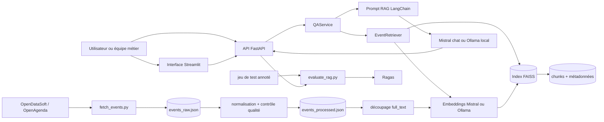

# Rapport technique - Assistant intelligent de recommandation d'événements culturels

## 1. Objectifs du projet

### Contexte

Puls-Events souhaite tester un assistant intelligent capable de répondre à des
questions utilisateurs sur des événements culturels. La mission consiste à
livrer un POC complet combinant récupération de données, indexation vectorielle,
génération de réponse et exposition via API REST.

Le système s'appuie sur le dataset public OpenDataSoft
`evenements-publics-openagenda`, qui expose des événements issus d'OpenAgenda.
Ce choix permet d'utiliser une source ouverte, requêtable sans clé API
OpenAgenda, tout en respectant la contrainte métier : fournir des
recommandations culturelles à partir de données récentes ou à venir.

### Problématique

Une recherche classique par mots-clés ne suffit pas toujours pour répondre à des
questions naturelles comme :

- "Je cherche un concert de Gospel Jazz pour la Fête de la musique à Paris."
- "Je veux faire une activité cosplay à la Cité des sciences."
- "Y a-t-il une avant-première du film RED BIRD à Paris ?"

Un système RAG répond à ce besoin en combinant :

- une recherche documentaire dans une base vectorielle ;
- la récupération de sources pertinentes ;
- une réponse naturelle générée par un LLM ;
- une réponse sourcée et exploitable par une API.

### Objectif du POC

Le POC cherche à démontrer trois points :

- Faisabilité technique : ingestion OpenDataSoft, embeddings Mistral, index
  FAISS, orchestration LangChain et API FastAPI.
- Valeur métier : réponse claire à des questions réalistes sur des événements
  culturels.
- Performance initiale : récupération de sources cohérentes et métriques
  d'évaluation automatisées avec Ragas.

### Périmètre

- Zone géographique : Paris par défaut.
- Période : 365 jours d'historique et 90 jours d'événements futurs.
- Source : endpoint public OpenDataSoft
  `evenements-publics-openagenda/records`.
- Données utilisées : titre, description, lieu, ville, dates, mots-clés et texte
  documentaire consolidé `full_text`.
- Historique conversationnel : hors périmètre du POC.

## 2. Architecture du système

### Schéma global



### Technologies utilisées

| Brique | Technologie | Rôle |
|---|---|---|
| Langage | Python 3.11 | Développement du pipeline et de l'API |
| Gestion projet | uv, requirements.txt | Reproductibilité de l'environnement |
| API | FastAPI, Uvicorn | Endpoints REST et Swagger |
| Données | OpenDataSoft / OpenAgenda | Source d'événements culturels |
| Vectorisation | Mistral `mistral-embed`, Ollama optionnel | Embeddings des chunks et questions |
| Base vectorielle | FAISS via LangChain | Recherche vectorielle locale |
| Génération | Mistral `mistral-small-latest`, Ollama optionnel | Réponse naturelle |
| Orchestration | LangChain | Prompt RAG, intégration FAISS et LLM |
| Évaluation | Ragas, pytest | Métriques RAG et tests automatisés |
| Démo | Docker, Docker Compose, Streamlit | Exécution locale et interface de test |

## 3. Préparation et vectorisation des données

### Source de données

Le projet utilise l'endpoint :

```text
https://public.opendatasoft.com/api/explore/v2.1/catalog/datasets/evenements-publics-openagenda/records
```

Les filtres appliqués sont :

- ville : Paris par défaut ;
- date de début non nulle ;
- ville non nulle ;
- fenêtre temporelle : J-365 à J+90 ;
- recherche texte optionnelle ;
- mots-clés optionnels.

La récupération gère la pagination OpenDataSoft avec `limit` et `offset`.

### Nettoyage

Les événements bruts sont normalisés dans `app/ingestion/normalize_events.py`.
Les traitements principaux sont :

- nettoyage des espaces, tabulations et retours ligne ;
- suppression du HTML dans les descriptions longues ;
- gestion des champs multilingues OpenAgenda ;
- harmonisation des champs `title`, `description`, `location_name`, `city`,
  `start`, `end`, `keywords` ;
- déduplication des mots-clés ;
- construction du champ `full_text`.

Exemple de structure `full_text` :

```text
Titre : Concert de Gospel Jazz
Mots-clés : jazz, gospel, concert
Ville : Paris
Lieu : 132 avenue de Versailles
Début : 2025-06-21T16:30:00+00:00
Fin : 2025-06-21T18:30:00+00:00
Description : ...
```

Un rapport qualité est généré pour suivre :

- la complétude des champs obligatoires ;
- la longueur du champ `full_text` ;
- les doublons d'UID ;
- le nombre d'événements indexables.

### Chunking

Le chunking est réalisé à partir de `full_text`.

Paramètres par défaut :

- taille de chunk : 800 caractères ;
- chevauchement : 100 caractères.

Le découpage limite la perte d'information quand les descriptions sont longues.
Les métadonnées métier restent attachées à chaque chunk pour pouvoir sourcer les
réponses.

### Embedding

Le modèle utilisé par défaut est `mistral-embed`.

Caractéristiques du POC :

- dimension observée de l'index FAISS local : 1024 ;
- vectorisation par lots de 64 textes par défaut ;
- délai configurable entre les lots ;
- retries simples en cas de limite de débit Mistral ;
- format final : listes de nombres flottants stockées dans FAISS via LangChain.

Une alternative locale existe avec `EMBEDDING_PROVIDER=ollama` et un modèle
comme `nomic-embed-text`. Dans ce cas, l'index doit être reconstruit, car le
modèle utilisé pour vectoriser la question doit être le même que celui utilisé
pour construire les vecteurs FAISS.

## 4. Choix du modèle NLP

### Modèles sélectionnés

- Embeddings par défaut : `mistral-embed`.
- Génération par défaut : `mistral-small-latest`.
- Génération locale optionnelle : Ollama, par exemple `qwen3:30b`.

### Pourquoi ces modèles ?

Ces modèles répondent bien au cadre du POC :

- compatibilité avec l'écosystème Python et LangChain ;
- qualité suffisante pour des réponses courtes et sourcées ;
- coût plus raisonnable qu'un modèle de génération plus lourd ;
- API simple à intégrer dans des scripts, tests et endpoints.

Ollama est ajouté comme fournisseur local pour limiter la dépendance à l'API
Mistral pendant une démonstration. Le mode `LLM_PROVIDER=ollama` force la
génération locale. Le mode `LLM_PROVIDER=auto` tente Mistral puis bascule vers
Ollama si l'appel externe échoue. Pour les modèles reasoning comme `qwen3:30b`,
`OLLAMA_MIN_TOKENS` impose un minimum de génération afin de laisser au modèle le
temps de produire une réponse finale après son raisonnement interne.

### Prompting

Le prompt système utilisé se trouve dans `app/rag/answer.py`.

Il impose au modèle de :

- répondre comme assistant culturel Puls-Events ;
- utiliser uniquement le contexte fourni ;
- signaler clairement si le contexte ne suffit pas ;
- proposer des événements concrets avec titre, lieu et date ;
- rester concis, utile et naturel.

### Limites du modèle

- Le modèle peut reformuler ou simplifier des horaires.
- Le mode local dépend du modèle Ollama installé et des ressources matérielles
  disponibles.
- Il dépend de la qualité des sources récupérées.
- Il ne remplace pas une validation humaine pour les données sensibles ou
  contractuelles.
- Les questions temporelles fines, par exemple "ce week-end", nécessiteraient
  des filtres explicites supplémentaires.

## 5. Construction de la base vectorielle

### FAISS utilisé

Le projet utilise FAISS via `langchain_community.vectorstores.FAISS`.

La construction est faite dans `app/rag/vector_store.py` :

- création des embeddings ;
- association de chaque vecteur à un chunk ;
- conservation des métadonnées ;
- sauvegarde locale de l'index.

### Stratégie de persistance

Les fichiers générés sont :

- `data/vector_store/index.faiss` : index vectoriel FAISS ;
- `data/vector_store/index.pkl` : structure LangChain associée ;
- `data/vector_store/chunks.json` : copie lisible des chunks et métadonnées.

Le chargement de `index.pkl` utilise la désérialisation LangChain. Elle est
acceptée ici car le fichier est produit localement par les scripts du projet.

### Métadonnées associées

Chaque chunk conserve :

- `event_uid` ;
- `chunk_index` ;
- titre ;
- ville ;
- nom du lieu ;
- date de début ;
- date de fin ;
- mots-clés.

Ces informations sont renvoyées dans les sources de l'API `/ask`.

## 6. API et endpoints exposés

### Framework utilisé

L'API est développée avec FastAPI.

Avantages :

- validation automatique des schémas avec Pydantic ;
- Swagger disponible sur `/docs` ;
- typage clair des requêtes et réponses ;
- intégration simple avec les tests `TestClient`.

### Endpoints clés

| Endpoint | Méthode | Rôle |
|---|---|---|
| `/health` | GET | Vérifier l'état de l'API et la présence de l'index |
| `/metadata` | GET | Exposer la configuration publique sans secret |
| `/ask` | POST | Poser une question au RAG |
| `/rebuild` | POST | Reconstruire le dataset et l'index |

### Format `/ask`

Requête :

```json
{
  "question": "Quels concerts de jazz sont disponibles à Paris ?",
  "top_k": 3,
  "retrieval_max_score": 0.45,
  "temperature": 0.2,
  "max_tokens": 600,
  "llm_provider": "auto",
  "llm_model": "qwen3:30b"
}
```

Réponse :

```json
{
  "question": "Quels concerts de jazz sont disponibles à Paris ?",
  "answer": "Réponse générée par le fournisseur LLM configuré.",
  "sources": [
    {
      "chunk_id": "39389254::chunk-0",
      "event_uid": "39389254",
      "title": "Concert de Gospel Jazz",
      "city": "Paris",
      "location_name": "132 avenue de versailles",
      "start": "2025-06-21T16:30:00+00:00",
      "end": "2025-06-21T18:30:00+00:00",
      "score": 0.2087
    }
  ],
  "parameters": {
    "top_k": 3,
    "retrieval_max_score": 0.45,
    "temperature": 0.2,
    "max_tokens": 600
  }
}
```

Le champ `score` correspond à une distance FAISS : plus elle est basse, plus le
chunk est proche de la question.

### Exemple d'appel API

```bash
curl -X POST http://127.0.0.1:8000/ask \
  -H "Content-Type: application/json" \
  -d "{\"question\":\"Y a-t-il une avant-première du film RED BIRD à Paris ?\"}"
```

### Tests effectués et documentés

- Tests unitaires des schémas et services.
- Tests d'intégration FastAPI.
- Script manuel `scripts/api_test.py`.
- Swagger disponible sur `http://127.0.0.1:8000/docs`.

### Gestion des erreurs et limitations

L'API gère :

- les questions vides ;
- l'absence d'index vectoriel ;
- les erreurs Mistral ou Ollama ;
- la protection optionnelle de `/rebuild` par token.

Limites :

- `/rebuild` est prévu pour un usage local ou protégé ;
- l'API ne gère pas encore de filtres temporels avancés dans `/ask`.

## 7. Évaluation du système

### Jeu de test annoté

Le jeu de test se trouve dans `tests/fixtures/qa_dataset.json`.

Il contient 5 exemples représentatifs :

- concert Gospel Jazz ;
- activité cosplay ;
- spectacle jeune public ;
- exposition d'art japonais ;
- avant-première du film RED BIRD.

Les réponses de référence ont été rédigées manuellement à partir des résultats
pertinents du dataset.

### Métriques d'évaluation

Le script `scripts/evaluate_rag.py` calcule :

- métriques locales :
  - nombre moyen de sources ;
  - distance FAISS moyenne ;
- métriques Ragas :
  - `faithfulness` ;
  - `answer_relevance` ;
  - `context_precision` ;
  - `semantic_similarity`.

### Résultats obtenus

Dernière évaluation observée :

| Métrique | Score |
|---|---:|
| Faithfulness | 0.9464 |
| Answer relevance | 0.8618 |
| Context precision | 1.0000 |
| Semantic similarity | 0.9522 |
| Sources moyennes | 3.0 |
| Distance FAISS moyenne | 0.3858 |

### Analyse quantitative

Les scores indiquent que :

- les réponses restent très proches des sources récupérées ;
- les réponses sont globalement pertinentes par rapport aux questions ;
- les contextes contenant la réponse attendue sont très bien classés ;
- la similarité avec les réponses annotées est élevée.

Le `context_precision` à 1.0 doit être interprété avec prudence : Ragas mesure
la qualité du classement des contextes pertinents. Dans les 5 cas annotés, le
premier contexte contient la réponse attendue. Cela ne signifie pas que tous les
contextes sont parfaits, mais que les contextes nécessaires sont bien placés.

### Analyse qualitative

Exemples de bons comportements :

- RED BIRD : le système retrouve l'avant-première exacte au Grand Rex.
- Cosplay : le système propose plusieurs événements à la Cité des sciences.
- Art japonais : le système retrouve l'exposition à la Maison de la culture du
  Japon.

Limites observées :

- Certaines sources secondaires sont moins pertinentes que la première.
- Les horaires peuvent être reformulés par le LLM.
- Le jeu de test reste petit : il valide un POC, pas une performance statistique
  complète.

## 8. Recommandations et perspectives

### Ce qui fonctionne bien

- Pipeline complet de bout en bout.
- API REST claire et documentée.
- Réponses JSON structurées avec sources.
- Évaluation automatisée avec Ragas.
- Démonstration locale possible avec Docker Compose et Streamlit.

### Limites du POC

- Jeu annoté limité à 5 questions.
- Périmètre géographique centré sur Paris.
- Coût et disponibilité liés aux appels Mistral si le mode par défaut est
  conservé.
- Performance variable du mode local selon le modèle Ollama choisi.
- Pas d'historique conversationnel.
- Pas encore de filtres temporels fins dans `/ask`.

### Améliorations possibles

- Ajouter des paramètres temporels explicites dans `/ask`.
- Étendre le dataset à d'autres villes.
- Augmenter le jeu de test annoté.
- Ajouter une CI lançant les tests et l'évaluation.
- Tester un reranker spécialisé si le volume de données augmente.
- Ajouter une authentification robuste pour un déploiement public.

## 9. Organisation du dépôt GitHub

```text
app/
|-- api/              # routes et schémas FastAPI
|-- clients/          # client OpenDataSoft
|-- ingestion/        # récupération, normalisation, qualité
|-- rag/              # chunking, embeddings, FAISS, génération
|-- services/         # orchestration QA et rebuild
|-- utils/            # helpers d'entrée/sortie
|-- config.py         # configuration centrale
scripts/              # scripts CLI : rebuild, API, évaluation
tests/                # tests unitaires, intégration, fixtures
data/                 # données locales utiles au pipeline, ignorées par Git
docs/                 # rapport technique, autoévaluation, soutenance
ui/                   # interface Streamlit
Dockerfile            # image locale API + UI
docker-compose.yml    # API FastAPI + Streamlit
README.md             # documentation principale
```

Chaque dossier est séparé par responsabilité afin de rendre le projet lisible et
facilement démontrable.

## 10. Annexes

### Extrait du jeu de test annoté

```json
{
  "question": "Y a-t-il une avant-première du film RED BIRD à Paris ?",
  "reference_answer": "Oui, l'avant-première du film RED BIRD est prévue au Grand Rex à Paris le 6 janvier 2026 à 20h30, en présence de l'équipe du film."
}
```

### Prompt utilisé

```text
Tu es l'assistant culturel de Puls-Events.
Réponds uniquement à partir du contexte fourni.
Si le contexte ne suffit pas, dis-le clairement.
Propose des événements concrets avec titre, lieu et date quand ils sont disponibles.
Reste concis, utile et naturel.
```

### Exemple de réponse JSON

```json
{
  "question": "Y a-t-il une avant-première du film RED BIRD à Paris ?",
  "answer": "Oui, il y a une avant-première du film RED BIRD à Paris...",
  "sources": [
    {
      "title": "Avant-Première du film \"RED BIRD\" au GRAND REX",
      "location_name": "Le Grand Rex (cinéma)",
      "city": "Paris",
      "start": "2026-01-06T19:30:00+00:00",
      "score": 0.2345
    }
  ]
}
```

### Commandes utiles

```bash
python scripts/rebuild_index.py --fetch --index --city Paris
python scripts/run_api.py
python scripts/api_test.py
python scripts/evaluate_rag.py
docker compose up --build
```
